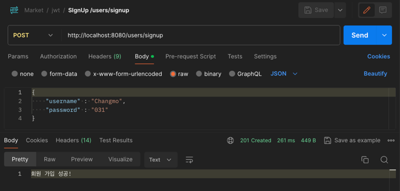

# Project -  Market


## ☀️ 프로젝트 소개
- 일반 사용자는 중고거래가 가능하며, 사업자는 인터넷 쇼핑몰을 운영할 수 있게 해주는
  쇼핑몰 사이트를 위한 REST API 구현


## 💻 개발 환경

- Language : `Java 17`
- Framework : `Spring Boot 3.2.1`, `querydsl`, `jjwt`, `smtp`
- Build : `gradle`
- DataBase : `SQLite`
- ORM : `JPA` 


## 📚 패키지 구조, DB 설계
<details>
<summary>패키지 구조</summary>
<div markdown="1">

```bash
└── src
    ├── main
    │   ├── java
    │   │   └── com
    │   │       └── example
    │   │           └── market
    │   │               ├── MarketApplication.java
    │   │               ├── config
    │   │               │   ├── JpaConfig.java
    │   │               │   ├── PasswordEncoderConfig.java
    │   │               │   └── WebSecurityConfig.java
    │   │               ├── shop
    │   │               │   ├── controller
    │   │               │   │   ├── ItemController.java
    │   │               │   │   ├── ItemOrderController.java
    │   │               │   │   ├── RootController.java
    │   │               │   │   └── ShopController.java
    │   │               │   ├── dto
    │   │               │   │   ├── ClosureRequestDto.java
    │   │               │   │   ├── EmailDto.java
    │   │               │   │   ├── ItemDto.java
    │   │               │   │   ├── ItemOrderDto.java
    │   │               │   │   ├── PaymentCancelDto.java
    │   │               │   │   ├── ProductSearchParams.java
    │   │               │   │   └── ShopDto.java
    │   │               │   ├── entity
    │   │               │   │   ├── Item.java
    │   │               │   │   ├── ItemOrder.java
    │   │               │   │   ├── Shop.java
    │   │               │   │   ├── ShopCategory.java
    │   │               │   │   └── ShopStatus.java
    │   │               │   ├── repo
    │   │               │   │   ├── ItemOrderRepository.java
    │   │               │   │   ├── ItemQuerydslRepo.java
    │   │               │   │   ├── ItemQuerydslRepoImpl.java
    │   │               │   │   ├── ItemRepository.java
    │   │               │   │   └── ShopRepository.java
    │   │               │   ├── service
    │   │               │   │   ├── EmailService.java
    │   │               │   │   ├── ItemOrderService.java
    │   │               │   │   ├── ItemService.java
    │   │               │   │   └── ShopService.java
    │   │               │   └── toss
    │   │               │       ├── TossController.java
    │   │               │       ├── TossHttpService.java
    │   │               │       ├── TossItemOrder.java
    │   │               │       ├── TossItemOrderDto.java
    │   │               │       ├── TossOrderController.java
    │   │               │       ├── TossOrderRepository.java
    │   │               │       ├── TossOrderService.java
    │   │               │       ├── TossPaymentConfirmDto.java
    │   │               │       └── config
    │   │               │           └── RestClientConfig.java
    │   │               ├── usedItem
    │   │               │   ├── controller
    │   │               │   │   ├── UsedItemController.java
    │   │               │   │   └── UsedItemProposalController.java
    │   │               │   ├── dto
    │   │               │   │   ├── UsedItemDto.java
    │   │               │   │   └── UsedItemProposalDto.java
    │   │               │   ├── entity
    │   │               │   │   ├── ProposalStatus.java
    │   │               │   │   ├── UsedItem.java
    │   │               │   │   └── UsedItemProposal.java
    │   │               │   ├── repo
    │   │               │   │   ├── UsedItemProposalRepository.java
    │   │               │   │   └── UsedItemRepository.java
    │   │               │   └── service
    │   │               │       ├── UsedItemProposalService.java
    │   │               │       └── UsedItemService.java
    │   │               └── user
    │   │                   ├── controller
    │   │                   │   ├── TokenController.java
    │   │                   │   └── UserController.java
    │   │                   ├── dto
    │   │                   │   └── UserDto.java
    │   │                   ├── entity
    │   │                   │   ├── CustomUserDetails.java
    │   │                   │   └── UserEntity.java
    │   │                   ├── jwt
    │   │                   │   ├── JwtRequestDto.java
    │   │                   │   ├── JwtResponseDto.java
    │   │                   │   ├── JwtTokenFilter.java
    │   │                   │   └── JwtTokenUtils.java
    │   │                   ├── repo
    │   │                   │   └── UserRepository.java
    │   │                   └── service
    │   │                       ├── JpaUserDetailsManager.java
    │   │                       └── UserService.java
    │   └── resources
    │       ├── application.yaml
    │       └── static
    │           ├── fail.html
    │           ├── item.html
    │           ├── items.html
    │           └── success.html
    └── test
        └── java
            └── com
                └── example
                    └── market
                        └── MarketApplicationTests.java
```
</div>
</details>

<details>
<summary>ERD</summary>
<div markdown="1">



</div>
</details>

## 📝 기능 요구사항
[API 명세 (Postman) Download](./md/postman/Market.postman_collection.json)

#### 1. 기본 기능 

- [사용자 인증 및 권한 처리(완료)](./md/auth.md)
- [중고거래 중개하기(완료)](./md/usedItem.md)
- [쇼핑몰 운영하기(완료)](./md/shop.md)

#### 2. 추가 기능
- [Tosspayments 결제 시스템(진행중)](./md/toss.md)


## 결론 


