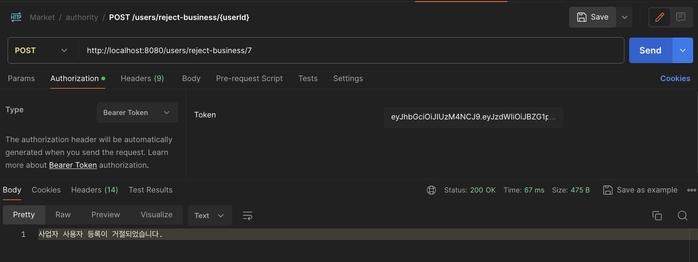

# 사용자 인증 및 권한 처리

<details>
<summary>요구 사항 체크 ✔️</summary>
<div markdown="1">

- ✅ 요청을 보낸 사용자가 누구인지 구분할 수 있는 인증 체계가 갖춰져야 한다. 
    - ✅ JWT 기반의 토큰 인증 방식이 권장된다.
    - ✅ 사용자는 별도의 클라이언트를 통해 아이디와 비밀번호를 전달한다.
    - ✅ 로그인 URL로 아이디와 비밀번호가 전달되면, 해당 내용의 정당성을 확인하여 JWT를 발급하여 클라이언트에게 반환한다.
    - ✅ 클라이언트는 이후 이 JWT를 Bearer Authentication 방식으로 제시해야 한다.


- ✅ 사용자는 회원가입이 가능하다.
  - ✅ 아이디, 비밀번호를 제공하여 회원가입이 가능하다.
  - ✅ 서비스를 이용하려면 닉네임, 이름, 연령대, 이메일, 전화번호 정보를 추가해야 한다.
  - ✅ 사용자의 프로필 이미지가 업로드 가능하다.


- ✅ 사용자의 권한이 관리되어야 한다.
  - ✅️ 네 종류의 사용자가 있다. (비활성 사용자, 일반 사용자, 사업자 사용자, 관리자)
  - ✅ 최초의 회원가입시 비활성 사용자로 가입된다.
  - ✅ 비활성 사용자가 서비스를 위한 필수 정보를 추가하면 일반 사용자로 자동으로 전환된다.
  - ✅ 일반 사용자는 자신의 사업자 등록번호(가정)을 전달해 사업자 사용자로 전환신청을 할 수 있다.
    - ✅ 사업자 등록번호는 실제 형식과 일치할 필요 없다.
  - ✅ 관리자는 사업자 사용자 전환 신청 목록을 확인할 수 있다.
  - ✅ 관리자는 사업자 사용자 전환 신청을 수락 또는 거절할 수 있다.
  - ✅ 관리자는 서비스와 상관없이 고정된 사용자이다.
    - ✅ 다른 회원가입 과정을 통해 만들어진 사용자는 관리자가 될 수 없다.

</div>
</details>


<br>

### 1. 사용자 회원가입
- 회원가입
  - 클라이언트로부터 `username` 과 `password` 가 담겨있는 UserDto` 를 받아온다.
  - `UserDto` 에 포함된 `username` 을 사용하여 이미 존재하는 사용자인지 확인
  - 만약 사용자가 존재하지 않는다면 새로운 `UserEntity` 객체를 생성, 이떄 패스워드는 인코딩하여 저장하고, 새로운 사용자의 권한은 비활성 사용자(`ROLE_INACTIVE_USER`) 로 설정된다.

<details>
<summary>Postman - 회원가입</summary>
<div markdown="1">


</div>
</details>

```java
 /**
     * 회원가입
     * @param dto 사용자의 username, password
     * @return 새로운 사용자를 생성 후 DB 저장
     */
    @PostMapping("/signup")
    public ResponseEntity<String> signUp(
            @RequestBody
            UserDto dto
    ) {
        if (manager.userExists(dto.getUsername())) {
            return ResponseEntity.status(HttpStatus.CONFLICT).body("사용자가 이미 존재합니다.");
        }

        // UserEntity 객체 생성
        UserEntity userEntity = UserEntity.builder()
                .username(dto.getUsername())
                .password(passwordEncoder.encode(dto.getPassword()))
                .authorities("ROLE_INACTIVE_USER")
                .build();

        // 저장
        userService.save(userEntity);
        return ResponseEntity.status(HttpStatus.CREATED).body("회원 가입 성공!");
    }
```


세션과 JWT 간단한 비교
- 세션
  - HTML 폼 기반의 로그인 페이지를 사용하여 인증을 처리하는 경우
- JWT
  - Restful API 통신에서의 인증 방식
  - 토큰에 사용자 인증 및 권한 정보 외에도 Claim 을 통한 사용자 정보를 포함시킬 수 있다.

<br>

### 2. JWT 발급, 검증

- JWT 발급
  - `JwtTokenUtils.java`
    - `JWT` 토큰 생성에 사용되는 메서드를 포함하는 유틸리티 클래스
    - 주로 사용자의 인증 정보를 바탕으로 `JWT` 토큰을 생성하는데 사용된다.
    - `generateToken()` 메서드는 `UserDetails` 객체를 입력으로 받아 해당 사용자를 나타내는 `JWT` 토큰을 생성한다.


<details>
<summary>Postman - JWT 발급</summary>
<div markdown="1">


</div>
</details>


```java
/**
 * userDetails 를 받아서 클레임으로 만들고, JWT로 변환하는 메서드
 * @param userDetails
 * @return
 */
public String generateToken(UserDetails userDetails) {
    // JWT에 담고싶은 정보를 Claims로 만든다.

    // 현재 호출되었을 때 epoch time
    Instant now = Instant.now();
    Claims jwtClaims = Jwts.claims()
            // sub : 누구인지
            .setSubject(userDetails.getUsername())
            // iat : 언제 발급 되었는지
            .setIssuedAt(Date.from(now))
            // exp : 언제 만료 예정인지
            .setExpiration(Date.from(now.plusSeconds(60 * 60 * 24 * 7)));

    // 최종적으로 JWT를 발급한다.
    return Jwts.builder()
            .setClaims(jwtClaims)
            .signWith(this.signingKey)
            .compact();
}
```


- JWT를 이용한 인증 - `Bearer Token` 인증 방식
  - `JWT` 를 비롯한 토큰을 활용해서 인증을 진행할 경우, `HTTP` 요청을 보낼 때 `Authorization Header` 에  `Bearer {token 값}` 의 형태로 추가해 보내게 된다.
  - 즉 서버에서는 들어온 `HTTP` 요청에 `Authorization` 이라는 헤더가 존재하는지, 존재한다면 거기에 담긴 값이 `Bearer` 로 시작하는지, 그리고 담겨있는 `Token` 이 유효한지 판단하는 `JwtFilter` 를 만들어야한다.
    - `JWT` 유효한지 알아보는 메서드 : `JwtTokenUtils.validate()`
    - `OncePerRequestFilter` 추상클래스로 필터 구현 : 사용자가 포함시킨 `JWT`의 유효성을 확인하고 `Spring Security`의 필터를 사용하여 사용자가 인증되었는지 여부를 판단


```java
/**
 * 토큰을 검증하여 정상적인 JWT 인지 판단하는 메서드
 * @param token
 * @return
 */
public boolean validate(String token) {
    try {
        // 정상적이지 않은 JWT라면 예외(Exception)가 발생한다.
        jwtParser.parseClaimsJws(token);
        return true;
    } catch (Exception e) {
        log.warn("invalid jwt");
    }
    return false;
}
```


- JWT Token Filter
  - `JWT` 토큰으로 사용자를 인증하고, 해당 사용자 정보를 `Spring Security` 의 인증 매커니즘에 연결하여 보안 작업 수행
    1. 클라이언트로부터 온 `HTTP` 요청을 받아서 `JWT` 토큰을 확인한다.
    2. `JWT` 토큰의 유효성을 검증한다.
    3. `JWT` 토큰이 유효하다면 해당 토큰을 사용하여 사용자 정보를 가져온다.
    4. 가져온 사용자 정보를 `Spring Security` 의 `SecurityContext`애 등록한다. (`SecurityContextHolder`로 관리)
       - ex) `String username = SecurityContextHolder.getContext().getAuthentication().getName();`
    5. 이후의 요청 처리를 위해 다음 필터로 요청을 전달한다.
- `JWT` 토큰을 검증헤야할 때 `HttpServletRequest`를 사용하여 헤더에서 JWT 토큰을 추출하는 것이 일반적
  

```java
public class JwtTokenFilter extends OncePerRequestFilter {
    private final JwtTokenUtils jwtTokenUtils;
    // 사용자 정보를 찾기위한 UserDetailsService 또는 Manager
    private final UserDetailsManager manager;
    
    ...

    // JWT 유효성 검증 & 현재 인증된 사용자의 정보를 SecurityContext에 반영
    @Override
    protected void doFilterInternal(
            HttpServletRequest request,
            HttpServletResponse response,
            FilterChain filterChain
    ) throws ServletException, IOException {
      log.debug("try jwt filter");
      // 1. Authorization 헤더를 회수
      String authHeader
              // = request.getHeader("Authorization");
              = request.getHeader(HttpHeaders.AUTHORIZATION);
      // 2. Authorization 헤더가 존재하는지 + Bearer로 시작하는지
      if (authHeader != null && authHeader.startsWith("Bearer ")) {
        String token = authHeader.split(" ")[1];
        // 3. Token이 유효한 토큰인지
        if (jwtTokenUtils.validate(token)) {
          // 4. 유효하다면 해당 토큰을 바탕으로 사용자 정보를 SecurityContext에 등록
          SecurityContext context = SecurityContextHolder.createEmptyContext();
          // 사용자 정보 회수
          String username = jwtTokenUtils
                  .parseClaims(token)
                  .getSubject();
  
          UserDetails userDetails = manager.loadUserByUsername(username);
          for (GrantedAuthority authority : userDetails.getAuthorities()) {
            log.info("authority: {}", authority.getAuthority());
          }
  
          // 인증 정보 생성
          AbstractAuthenticationToken authentication =
                  new UsernamePasswordAuthenticationToken(
                          userDetails,
                          token,
                          userDetails.getAuthorities()
                  );
          // 인증 정보 등록
          context.setAuthentication(authentication);
          SecurityContextHolder.setContext(context);
          log.info("set security context with jwt");
        }
        else {
          log.warn("jwt validation failed");
        }
      }
      // 5. 다음 필터 호출
      // doFilter를 호출하지 않으면 Controller까지 요청이 도달하지 못한다.
      filterChain.doFilter(request, response);
    }
    
    ...
```


<br>

### 3. 사용자 권한 처리

- `String username = SecurityContextHolder.getContext().getAuthentication().getName();`
  - `SecurityContextHolder`의 `getContext()` 메서드
    - 스프링 시큐리티의 `SecurityContext` 객체를 반환, 이 컨텍스트에는 현재 인증된 사용자의 인증 및 보안 정보가 포함되어 있다.
    - `SecurityContextHolder.getContext().getAuthentication()` 을 호출하면 현재 사용자의 인증 객체(`Authentication`)를 가져온다. 
  - `getName()` 으로 username 필드 값 가져오기
- `username` 을 `userRepository`의 `findByUsername`을 가지고 사용자 객체를 조회하여 CRUD 
- 사용자 객체의 `authorities` 필드 
  - `userEntity.setAuthorities("ROLE_???")` 으로 `ROLE`을 설정한다.
  - `WebSecurityConfig` 파일의 `SecurityFilterChain` 메서드에서 ROLE 에 따른 Http 접근 권한을 설정한다.
    - ex) `.authorizeHttpRequests(auth -> auth.requestMatchers("").hasAnyRole("USER", "BUSINESS_USㅋER", "ADMIN"))`
      - `"USER"`, `"BUSINESS_USER"`, `"ADMIN"` 사용자만 허용


<details>
<summary>Postman - 추가 정보 기입</summary>
<div markdown="1">


</div>
</details>

```java
/**
* 회원정보 추가
* @param dto 추가정보가 담긴 UserDto
* @return 추가 정보 업데이트
*/
@PostMapping("/profile-info")
public ResponseEntity<String> profileInfo(
      @RequestBody UserDto dto
) {
  // 현재 인증된 사용자의 이름 가져오기
  String username = SecurityContextHolder.getContext().getAuthentication().getName();

  // 데이터베이스에서 사용자 정보 가져오기
  Optional<UserEntity> optionalUserEntity = userRepository.findByUsername(username);
  if (optionalUserEntity.isPresent()) {
      // 업데이트할 정보 설정
      UserEntity userEntity = optionalUserEntity.get();
      userEntity.setNickname(dto.getNickname());
      userEntity.setName(dto.getName());
      userEntity.setAge(dto.getAge());
      userEntity.setEmail(dto.getEmail());
      userEntity.setPhone(dto.getPhone());
      userEntity.setAuthorities("ROLE_USER"); // 일반 사용자로 승급
      userRepository.save(userEntity);

      return ResponseEntity.status(HttpStatus.OK).body("프로필 추가 정보 작성 완료!");
  } else {
      return ResponseEntity.status(HttpStatus.UNAUTHORIZED).body("권한 없음");
  }
}
```


<br>

### 4. 프로필 이미지 업로드
<details>
<summary>Postman - 프로필 이미지 업로드</summary>
<div markdown="1">


</div>
</details>


```java
/**
* 사용자 프로필 이미지 업로드
*
* @param multipartFile 이미지 파일
* @return 이미지 파일 업로드
* @throws IOException transferTo 로 저장
*/
@PostMapping(
      value = "/avatar",
      consumes = MediaType.MULTIPART_FORM_DATA_VALUE
)
public ResponseEntity<String> avatar(
      @RequestParam("file")
      MultipartFile multipartFile
) throws IOException {
  // 현재 인증된 사용자의 정보 가져오기
  String username = SecurityContextHolder.getContext().getAuthentication().getName();
  // 데이터베이스에서 사용자 정보 가져오기
  Optional<UserEntity> optionalUserEntity = userRepository.findByUsername(username);
  if (optionalUserEntity.isPresent()) {
      UserEntity userEntity = optionalUserEntity.get();
      // 폴더 경로 생성: media/{username}/
      String profileDir = String.format("media/%s/", username);
      try {
          // 폴더 생성
          Files.createDirectories(Path.of(profileDir));
      } catch (IOException e) {
          // 폴더를 만드는데 실패하면 기록을 하고 사용자에게 알림
          log.error(e.getMessage());
          return ResponseEntity.status(HttpStatus.INTERNAL_SERVER_ERROR).body("디렉토리 생성 실패");
      }
      // 파일 조합: media/{username}/profile.{확장자}
      String originalFilename = multipartFile.getOriginalFilename();
      String[] fileNameSplit = originalFilename.split("\\.");
      String extension = fileNameSplit[fileNameSplit.length - 1];
      String profileFilename = "profile." + extension;
      String profilePath = profileDir + profileFilename;
      log.info(profileFilename);

      multipartFile.transferTo(Path.of(profilePath));
      log.info(profilePath);

      // 업로드된 파일의 URL 저장
      String requestPath = String.format("/media/%s/%s", username, profileFilename);
      userEntity.setAvatar(requestPath);
      userRepository.save(userEntity);
      // 성공적으로 업로드된 메시지 반환
      return ResponseEntity.status(HttpStatus.OK).body("프로필 이미지가 업로드 되었습니다.");
  } else {
      // 사용자를 찾을 수 없을 경우 오류 메시지 반환
      return ResponseEntity.status(HttpStatus.UNAUTHORIZED).body("사용자를 찾을 수 없습니다.");
  }
}
```


<br>

### 5. 사업자 번호 등록, 승인, 거절

<details>
<summary>Postman - 사업자 번호 등록, 승인, 거절</summary>
<div markdown="1">

사업자 번호 등록 및 사업자 사용자 신청


관리자의 사업자 사용자 신청 목록 조회


관리자의 사업자 사용자 신청 수락 후 `ROLE_BUSINESS_USER` 로 변경


관리자의 사업자 사용자 신청 거절



</div>
</details>

```java
/**
* 사업자 등록번호 신청 (ROLE_USER 일떄만 가능)
* @param dto businessNumber 만 포함
* @return 해당 사용자의 사업자 등록번호 컬럼에 데이터 추가
*/
@PostMapping("/register-business")
public ResponseEntity<String> registerBusinessUser(
      @RequestBody
      UserDto dto
) {
  String username = SecurityContextHolder.getContext().getAuthentication().getName();
  // 사용자 정보 가져오기
  Optional<UserEntity> optionalUserEntity = userRepository.findByUsername(username);
  if (optionalUserEntity.isPresent()) {
      UserEntity userEntity = optionalUserEntity.get();
      // 자신의 사업자 번호 등록 (데이터베이스에)
      userEntity.setBusinessNumber(dto.getBusinessNumber());
      userRepository.save(userEntity);
      return ResponseEntity.ok("사업자 등록번호 신청 완료");
  } else {
      return ResponseEntity.badRequest().body("사용자를 찾을 수 없습니다.");
  }
}

/**
* 사업자 등록 번호가 존재하는 사용자 정보 반환
* @return 사용자 정보 반환
*/
@GetMapping("/read-business")
public ResponseEntity<List<UserEntity>> getBusinessUserRequest() {
  List<UserEntity> businessUserRequests = userRepository.findByBusinessNumberNotNull();
  return ResponseEntity.ok(businessUserRequests);
}


/**
* 사업지 사용자 신청 승인
* @param userId
* @return
*/
@PostMapping("/approve-business/{userId}")
public ResponseEntity<String> approveBusinessUserRequest(
      @PathVariable
      Long userId
) {
  // 사용자의 정보 가져오기
  Optional<UserEntity> optionalUser = userRepository.findById(userId);
  if (optionalUser.isPresent()) {
      UserEntity userEntity = optionalUser.get();

      // 사업자 사용자 권한으로 설정
      userEntity.setAuthorities("ROLE_BUSINESS_USER");
      userRepository.save(userEntity);

      // PREPARING 상태인 쇼핑몰이 생성이 되어,
      // shop 레포지토리에 추가된다.
      shopService.registerShop(userEntity);

      return ResponseEntity.ok("사업자 사용자 등록이 완료되었고, 쇼핑몰이 추가되었습니다.");
  } else {
      return ResponseEntity.badRequest().body("사용자를 찾을 수 없습니다.");
  }
}

/**
* 사업자 사용자 신청 거절 후 데이터베이스에서 해당 사용자의 사업자 번호 삭제
* @param userId
* @return
*/
@PostMapping("/reject-business/{userId}")
public ResponseEntity<String> rejectBusinessUserRequest(
      @PathVariable
      Long userId
) {
  Optional<UserEntity> optionalUser = userRepository.findById(userId);
  if (optionalUser.isPresent()) {
      UserEntity userEntity = optionalUser.get();
      userEntity.setBusinessNumber(null);
      userRepository.save(userEntity);
      return ResponseEntity.ok("사업자 사용자 등록이 거절되었습니다.");
  } else {
      return ResponseEntity.badRequest().body("사용자를 찾을 수 없습니다.");
  }
}

```


<br>

## 오류 해결

### 1) JWT 발급 오류

1. **JWT 토큰 암호화 복호화 과정**
   - `claim` 을 통한 사용자 정보 지정 및 `singWith()` 을 통해 서버에서 관리하는 시크릿 키 및 서명 시 암호화
   
   - 해당 토큰을 다시 해독할 때 서버 내에서 관리하는 시크릿 키를 통해서 해독
   

2. **JWT Access Token 파싱안되는 오류 (Feat. Signed Claims JWSs are not supported.)**
   - 이때, `parseClaimsJwt()` 메서드를 사용하면 오류 발생
   - 우리가 처음 토큰을 생성할 때 `signWith` 을 통해서 서명을 진행했기 때문에 복호화 시에도 서명에 대한 검증을 진행해야 하기 떼문
     - Jwt() 의 경우 서명 검증 없이 단순히 헤더와 클레임만 추출함
   - `parseClaimsJwt()` 를 사용하고 싶다면 토큰 생성 시에 `signWith` 을 통해서 서명에 대한 정보를 넘겨주지 않으면 된다.

3. **해결**
   - `parseClaimsJwt()`를 `parseClaimsJws()`로 수정하여 해결

<br>


### 2) SecurityContext에 저장된 사용자 데이터가 업데이트되지 않는 문제
- `Spring Security`는 사용자의 권한 정보를 기본적으로 `UserDetails` 객체에 저장한다.
- 따라서, 사용자 정보를 업데이트 할때 `UserDetails` 객체를 생성하고 업데이트 해야한다.
  - `UserDetails` 를 확장한 `CustomUserDetails` 클래스를 만들어서 사용하고 있다.
  - `CustomUserDetails` 클래스는 사용자의 추가 속성을 포함할 수 있다. (`nickname`, `name` 등)


- 사용자 정보를 등록할 때 `CustomerUserDetails` 객체를 생성하도록 한다.
  


- `UserEntity` 를 통해서 새로운 사용자가 데이터베이스에 저장될 때, 그 사용자 정보를 가져와서 `CustomUserDetails` 객체로 만들고
- `Spring Security`는 그 객체를 `UserDetails` 로 인식하여 인증 처리에 사용하게 되면서 사용자 정보가 업데이트 되게 된다.
  

- 정리
  - 기본적으로 `UserDetails` 라는 객체를 구현한 `User` 라는 객체는 기본적으로 스프링에서 제공을 하는 객체이다.
  - 위 `UserDetails` 의 로직을 담당하는 것이 바로 `UserDetailsService`
  - 그런데 이 `UserDetailsService` 를 좀 더 확장한 것이 바로 `UserDetailsManager` 이고, 이를 구현한 구현체인 `JpaUserDetailsManager` (이름을 이렇게 붙인 것) 가 실질적인 `UserDetails` 객체를 대상으로 로직을 적용한 서비스 클래스인 것이다.
  - 일단 기본적으로 `User` 클래스는 다음을 필드를 포함한다. 
    - `username`
    - `password`
    - `authorities`
  - 이처럼 기본적인 인증 및 권한 정보만 저장한다. 즉 이것 외에는 `User` 라는 객체가 갖고 있는 것 외에는 내가 직접 객체를 커스텀 해서 만들어야한다는 의미이다.
  - 따라서 `CustomUserDetails` 를 사용하여 `UserDetails` 객체를 좀 더 확장하자.
  - 우리가 원래 작성하고자 했던 일반 `UserEntity` 를 `CustomUserDetails` 로 변환하는 `fromEntity`를 작성을 하였는데 우리는 이런 변환 과정을 통해서 `CustomUserDetails`를 활용한 `JpaUserDetailsManager`를 작성할 수 있다.
  - `JpaUserDetailsManager` 의 `createUser` 메서드의 경우 원래는 `UserDetails`를 구현한 user 라는 기본 제공 객체를 매개변수로 받는다 (즉, 우리는 사용자를 만들때, `username`, `password` 만 사용할 것이기 때문에 간단하게 `user` 를 사용)
    - 그렇게 만든 `user` 를 매개변수로 `createUser` 를 호출할때, `user` 에 담겨있는 `username`, `password` 라는 정보에 다른 사용자 정보를 포함시켜주기 위하여 `CustomUserDetails` 라는 객체로 업캐스팅해준다.
    - `CustomUserDetails userDetails = (CustomUserDetails) user;`
  - 그렇게 생성된 `userDetails` 를 가지고 레포지토리에 저장을 한다.
  - 회원가입을 하고, 토큰을 등록한 다음에 그떄 `SecurtiyContext` 에 변경사항을 저장하는 것이 의미있지 그거 아니고서야 굳이 회원 가입 하자마자 `SecurtiyContext` 에 저장할 필요는 없다 (feat. `authorities`)