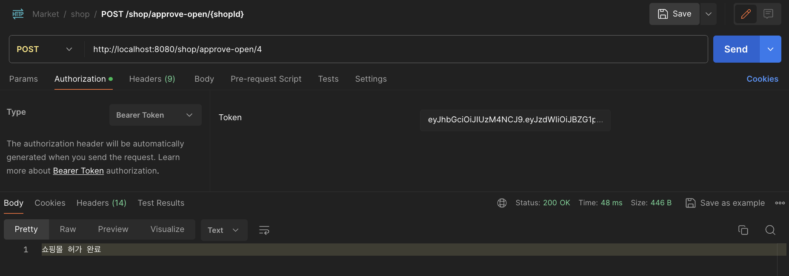
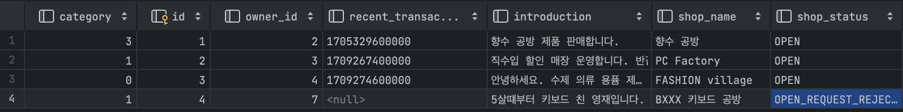

# 쇼핑몰 운영하기

요구 사항 체크 ✔️

- ✅ 쇼핑몰 개설
    - ✅ 일반 사용자가 사업자 사용자로 전환될 때 **준비중** 상태의 쇼핑몰이 추가된다. 사업자 사용자는 이 쇼핑몰의 주인이 된다.
    - ✅ 쇼핑몰에는 이름, 소개, 분류의 정보를 가지고 있으며, 주인은 자유롭게 수정이 가능하다.
        - ✅ 분류의 종류는 서비스 제작자에 의해 미리 정해진다. (최소 5)
    - ✅ 쇼핑몰의 이름, 소개, 분류가 전부 작성된 상태라면 쇼핑몰을 개설 신청을 할 수 있다.
    - ✅ 관리자는 개설 신청된 쇼핑몰의 목록을 확인할 수 있으며, 정보를 확인후 허가 또는 불허 할 수 있다.
        - ✅ 불허 할 경우 그 이유를 함께 작성해야 한다.
        - ✅ 불허된 이유를 쇼핑몰의 주인이 확인할 수 있어야 한다.
    - ✅ 개설이 허가된 쇼핑몰을 **오픈** 상태가 된다.
    - ✅ 쇼핑몰 주인은 사유를 작성하여 쇼핑몰 폐쇄 요청을 할 수 있다.
        - ✅ 관리자는 쇼핑몰 폐쇄 요청을 확인 후 수락할 수 있다.

- ✅ 쇼핑몰 관리
    - ✅ 쇼핑몰 주인은 쇼핑몰에 상품을 등록할 수 있다.
        - ✅ 필수적인 정보는 상품 이름, 상품 이미지, 상품 설명, 상품 가격, ~~상품 분류, 상품 소분류,~~ 상품 재고가 있다.
        - ✅ ~~상품 분류와 소분류는 쇼핑몰의 주인이 추가하거나, 다른 쇼핑몰 주인이 추가했던 분류를 바탕으로 선택할 수 있다.~~
    - ✅ ~~관리자는 상품 분류 목록을 보고, 유사한 분류를 같은 분류가 될 수 있도록 분류를 수정할 수 있다.~~
        - ✅ ~~쇼핑몰 주인이 취해야 하는 추가적 행동은 없다.~~
    - ✅ 쇼핑몰 주인은 등록한 상품을 수정할 수 있다.
    - ✅ ~~쇼핑몰 주인은 등록한 상품의 할인을 진행할 수 있다.~~
        - ✅ ~~기한과 할인율을 바탕으로, 할인 가격이 자동으로 적용되도록 한다.~~
    - ✅ 쇼핑몰 주인은 등록한 상품을 삭제할 수 있다.

- ✅ 쇼핑몰 조회
    - ✅ 비활성 사용자를 제외한 사용자는 쇼핑몰을 조회할 수 있다.
        - 🆘 조건 없이 조회할 경우, 가장 최근에 거래가 있었던 쇼핑몰 순서로 조회된다.
        - 🆘 이름, 쇼핑몰 분류, ~~등록된 상품 분류, 등록된 상품 소분류~~ 를 조건으로 쇼핑몰을 검색할 수 있다. ~~단, 분류와 소분류는 하나만 선택이 가능하다.~~

- ✅ 쇼핑몰 상품 검색
    - ✅ 비활성 사용자를 제외한 사용자는 쇼핑몰의 상품을 검색할 수 있다.
        - ✅ 이름, ~~상품 분류, 상품 소분류,~~ 가격 범위를 기준으로 상품을 검색할 수 있다. ~~단, 분류와 소분류는 하나만 선택이 가능하다.~~
        - ✅ 조회되는 상품이 등록된 쇼핑몰에 대한 정보가 함께 제공되어야 한다.

- ✅ 쇼핑몰 상품 구매
    - ✅ 비활성 사용자를 제외한 사용자는 쇼핑몰의 상품을 구매할 수 있다.
        - ✅ 상품과 구매 수량을 기준으로 구매 요청을 할 수 있다.
        - ✅ 구매 요청 후 사용자는 구매에 필요한 금액을 전달한다고 가정한다.
        - ✅ 주인이 전달된 금액을 확인하면 구매 요청을 수락할 수 있다.
        - ✅ 구매 요청이 수락되면, 상품 재고가 자동으로 갱신된다. 이후엔 구매 취소가 불가능하다.
        - ✅ 구매 요청이 수락되기 전에는 구매 요청을 취소할 수 있다.

## Postman 테스트 과정 

### 쇼핑몰 개설

- http://localhost:8080/users/approve-business/7 로 사업자 사용자 신청을 수락하면, 해당 사용자의 쇼핑몰이 임시로 개설된다.
- 사용자는 쇼핑몰 폐쇄 요청을 보낼 수 있다. (분량 관계상 콘솔 출력으로 대체)

### Google Gmail SMTP 이메일 보내기

- [Spring Boot 에서 API를 통한 이메일 전송 기능 만들기](https://sundries-in-myidea.tistory.com/113)를 참고하여 해당 기능을 구현하였다.

### 쇼핑몰 관리

- 기본적인 데이터 추가

- User1 은 쇼핑몰에 상품을 추가, 수정, 삭제 가능.

  
### 쇼핑몰 조회

- 쇼핑몰의 목록을 조회가능
- 이부분은 일단은 querydsl 을 사용하지 않고 모두 조회를 하되 (최근 거래가 있었던 순서로 조회하였다 - 쿼리메서드 사용 (수정 예정))
- 이름, 쇼핑몰 분류에 대한 검색 기능은 갖추지 못한 상태

  
### 쇼핑몰 상품 검색

- 모니터만 검색

- 모니터랑 가격 범위를 함께 검색

### Querydsl 정리
TODO

### 쇼핑몰 상품 구매
user2의 상품을 구매 요청

user1의 상품 구매 요청을 승인

user1의 상품 구매 요청 거절

