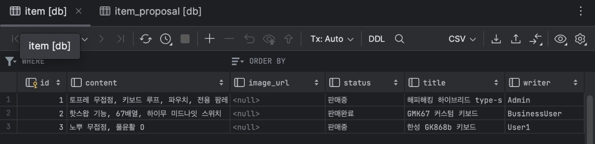
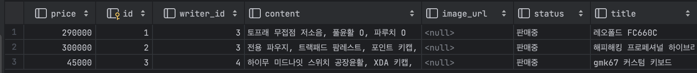

# 중고거래 중개하기

<details>
<summary>요구 사항 체크 ✔️</summary>
<div markdown="1">

- ✅ 물품 등록
    - ✅ 일반 사용자는 중고 거래를 목적으로 물품에 대한 정보를 등록할 수 있다.
        - ✅ 제목, 설명, 대표 이미지, 최소 가격이 필요하다.
            - ✅ 대표 이미지는 반드시 함께 등록될 필요는 없다.
            - ✅ 다른 항목은 필수이다.
            - ✅ 최초로 물품이 등록될 때, 중고 물품의 상태는 **판매중** 상태가 된다.
    - ✅ 등록된 물품 정보는 비활성 사용자를 제외 누구든지 열람할 수 있다.
        - ✅ 사용자의 상세 정보는 공개되지 않는다.
    - ✅ 등록된 물품 정보는 작성자가 수정, 삭제가 가능하다.
  

- ✅ 구매 제안
    - ✅ **물품을 등록한 사용자**와 **비활성 사용자** 제외, 등록된 물품에 대하여 구매 제안을 등록할 수 있다.
    - ✅ 등록된 구매 제안은 **물품을 등록한 사용자**와 **제안을 등록한 사용자**만 조회가 가능하다.
        - ✅ **제안을 등록한 사용자**는 자신의 제안만 확인이 가능하다.
        - ✅ **물품을 등록한 사용자**는 모든 제안이 확인 가능하다.
    - ✅ **물품을 등록한 사용자**는 **등록된 구매 제안**을 수락 또는 거절할 수 있다.
        - ✅ 이때 구매 제안의 상태는 **수락** 또는 **거절**이 된다.
    - ✅ **제안을 등록한 사용자**는 자신이 등록한 제안이 수락 상태일 경우, 구매 확정을 할 수 있다.
        - ✅ 이때 구매 제안의 상태는 **확정** 상태가 된다.
        - ✅ 구매 제안이 확정될 경우, 대상 물품의 상태는 **판매 완료**가 된다.
        - ✅ 구매 제안이 확정될 경우, 확정되지 않은 다른 구매 제안의 상태는 모두 **거절**이 된다.

</div>
</details>


### 1. 일반 사용자의 중고 물품 등록

<details>
<summary>Postman - 일반 사용자의 중고 뭂품 등록, 물품 이미지 등록</summary>
<div markdown="1">

중고 물품 등록


중고 물품 이미지 등록


</div>
</details>

```java
/**
 * 일반 사용자의 물품 등록
 * @param dto
 * @return
 */
public void registerItem(UsedItemDto dto) {
    // 현재 인증된 사용자의 정보 가져오기
    String username = SecurityContextHolder.getContext().getAuthentication().getName();
    UserEntity userEntity = getCurrentUserFromUsername(username);

    // 물품 객체 생성
    UsedItem usedItemEntity = UsedItem.builder()
    .title(dto.getTitle())
    .content(dto.getContent())
    .price(dto.getPrice())
    .status("판매중") // 기본값 설정
    .writer(userEntity)
    .build();

    usedItemRepository.save(usedItemEntity);
}

/**
 * 일반 사용자(현재 인증된)가 등록한 물품의 이미지 등록
 * @param multipartFile 이미지 파일 업로드
 * @param itemId 이미지를 업로드할 물품의 id
 * @return void
 * @throws IOException
 */
public void registerItemImage(MultipartFile multipartFile, Long itemId) throws IOException {
    // 사용자 정보 가져오기
    String username = SecurityContextHolder.getContext().getAuthentication().getName();
    UserEntity userEntity = getCurrentUserFromUsername(username);

    // 물품 정보 가져오기
    UsedItem usedItemEntity = getItemFromId(itemId);

    if (usedItemEntity.getWriter().getId().equals(userEntity.getId())) {
    // 파일 저장 경로 설정
    String profileDir = String.format("media/%s/", username);
    try {
    // 폴더 생성
    Files.createDirectories(Paths.get(profileDir));
    } catch (IOException e) {
    log.error(e.getMessage());
    throw new ResponseStatusException(HttpStatus.INTERNAL_SERVER_ERROR, "디렉토리 생성 실패");
    }

    // 파일명 조합: media/{username}/profile.{확장자}
    String originalFilename = multipartFile.getOriginalFilename();
    String[] fileNameSplit = originalFilename.split("\\.");
    String extension = fileNameSplit[fileNameSplit.length - 1];
    String profileFilename = "product." + extension;
    String profilePath = profileDir + profileFilename;
    log.info(profileFilename);

    multipartFile.transferTo(Path.of(profilePath));
    log.info(profilePath);

    // 업로드된 파일의 URL 저장
    String requestPath = String.format("/media/%s/%s", username, profileFilename);
    usedItemEntity.setImageUrl(requestPath);
    usedItemRepository.save(usedItemEntity);
    }
}
```

### 2. 중고 물품 조회, 수정, 삭제

<details>
<summary>Postman - 일반 사용자의 중고 뭂품 조회, 수정, 삭제</summary>
<div markdown="1">

중고 물품 조회


중고 물품 수정


중고 물품 삭제


</div>
</details>

```java
/**
* 물품 전체 조회 서비스
* @return 조회된 물품 리스트
*/
public List<UsedItemDto> readAll() {
return usedItemRepository.findAll().stream()
        .map(item -> {
            UsedItemDto usedItemDto = UsedItemDto.fromEntity(item);
            usedItemDto.setWriterId(item.getWriter().getId()); // 작성자의 username을 설정
            return usedItemDto;
        })
        .toList();
}

/**
 * 물품 수정
 * @param dto 수정 내용
 * @param itemId 수정할 물품의 id
 * @return 업데이트가 완료되었으면 true, 아니면 false
 */
@Transactional
public Boolean updateItem(UsedItemDto dto, Long itemId) {

    // 물품 정보 조회
    UsedItem usedItemEntity = getItemFromId(itemId);

    // 사용자 정보 가져오기
    String username = SecurityContextHolder.getContext().getAuthentication().getName();
    UserEntity userEntity = getCurrentUserFromUsername(username);

    // itemId 에 헤댕하는 물품의 writer_id 와 현재 인증된 사용자의 id 가 같으면
    if (usedItemEntity.getWriter().getId().equals(userEntity.getId())) {
    usedItemEntity.setTitle(dto.getTitle());
    usedItemEntity.setContent(dto.getContent());
    usedItemEntity.setPrice(dto.getPrice());
    usedItemRepository.save(usedItemEntity);
    return true;
    }
    return false;
}

/**
 * 물품 삭제
 * @param itemId 삭제할 물품의 id
 * @return 조회한 물품을 삭제했으면 true, 아니면 false
 */
@Transactional
public boolean deleteItem(Long itemId) {
    // 사용자 정보 가져오기
    String username = SecurityContextHolder.getContext().getAuthentication().getName();
    UserEntity userEntity = getCurrentUserFromUsername(username);

    // 물품 정보 조회
    UsedItem usedItemEntity = getItemFromId(itemId);

    // itemId 에 헤댕하는 물품의 writer_id 와 현재 인증된 사용자의 id 가 같으면
    if (usedItemEntity.getWriter().getId().equals(userEntity.getId())) {
    // 조회한 물품 삭제
    usedItemRepository.delete(usedItemEntity);
    return true;
    }
    return false; // 물품을 찾을 수 없거나 권한이 없음
}
```

<br>

### 데이터베이스 정보 가져오기 
JWT 사용자 인증 정보, Path 파라미터로 부터 데이터베이스의 저장된 값을 가져온다.
서비스 메서드마다 중복되어 사용되므로 따로 메서드를 만들어서 사용

```java
private UserEntity getCurrentUserFromUsername(String username) {
    Optional<UserEntity> optionalUserEntity = userRepository.findByUsername(username);
    if (optionalUserEntity.isEmpty())
    throw new ResponseStatusException(HttpStatus.INTERNAL_SERVER_ERROR, "사용자 정보를 찾을 수 없습니다.");
    return optionalUserEntity.get();
}

private UsedItem getItemFromId(Long itemId) {
    // 물품 정보 조회
    Optional<UsedItem> optionalItem = usedItemRepository.findById(itemId);
    if (optionalItem.isEmpty())
    throw new ResponseStatusException(HttpStatus.INTERNAL_SERVER_ERROR, "물품 정보를 찾을 수 없습니다.");
    return optionalItem.get();
}
```

<br>

### 2. 구매 제안 등록하기

<details>
<summary>Postman - 중고 뭂품 구매 제안 등록, </summary>
<div markdown="1">

중고 물품 구매 제안

BusinessUser, User1 이라는 username 을 가진 사용자로 로그인

Changmo 사용자가 등록한 중고 물품에 대한 구매 제안 등록 (대기중 PENDING 상태)


</div>
</details>

```java
/**
 * 상품 구매 제안 등록하기
 * @param usedItemId
 * @return
 */
public void createProposal(Long usedItemId) {
    // 현재 인증된 사용자 정보 가져오기
    String username = SecurityContextHolder.getContext().getAuthentication().getName();
    UserEntity userEntity = getCurrentUserFromUsername(username);
    // 물품 조회
    UsedItem usedItemEntity = getUsedItemFromId(usedItemId);

    // 해당 물품을 등록한 사용자는 제외
    if (!userEntity.getId().equals(usedItemEntity.getWriter().getId())) {
        // 구매 제안 등록
        UsedItemProposal proposal = new UsedItemProposal();
        proposal.setUsedItem(usedItemEntity);
        proposal.setProposer(userEntity); // UserEntity 객체 설정
        proposal.setStatus(ProposalStatus.PENDING); // 대기 중 상태로 등록
        usedItemProposalRepository.save(proposal);
    } else {
        throw new ResponseStatusException(HttpStatus.FORBIDDEN, "해당 물품을 등록한 사람은 구매 제안을 등록할 수 없습니다.");
    }
}
```

<br>

### 3. 구매 제안 확인하기

<details>
<summary>Postman - 중고 뭂품 구매 제안 확인 </summary>
<div markdown="1">

중고 물품 구매 제안 확인

- 해당 중고 물품을 구매한 사용자라면 (BusinessUser 또는 User1)


- 해당 중고 물품을 등록한 사용자라면 (Changmo)


</div>
</details>

```java
/**
 * 구매 제안 확인
 * 등록된 구매 제안은 물품을 등록한 사용자와 제안을 등록한 사용자만 조회 가능
 * @param usedItemId
 * @return
 */
public List<UsedItemProposalDto> getItemProposals(Long usedItemId) {
    // 현재 인증된 사용자 정보 가져오기
    String username = SecurityContextHolder.getContext().getAuthentication().getName();
    UserEntity userEntity = getCurrentUserFromUsername(username);
    // 물품 조회
    UsedItem usedItemEntity = getUsedItemFromId(usedItemId);

    // 해당 물품을 등록한 사용자라면
    if (usedItemEntity.getWriter().getId().equals(userEntity.getId())) {
    // 해당 물품에 대한 다른 사람들의 모든 구매 제안을 확인 가능
        List<UsedItemProposal> allProposals = usedItemProposalRepository.findByUsedItem(usedItemEntity);
        return allProposals.stream()
            .map(UsedItemProposalDto::fromEntity)
            .collect(Collectors.toList());
    }
    // 해당 물품을 구매 제안한 사람이라면
    else {
        List<UsedItemProposal> userProposals = usedItemProposalRepository.findByUsedItemAndProposerUsername(usedItemEntity, username);
        return userProposals.stream()
            .map(UsedItemProposalDto::fromEntity)
            .collect(Collectors.toList());
    }
}
```

<br>

### 4. 구매 제안 수락, 거절

<details>
<summary>Postman - 중고 뭂품 구매 제안 수락 </summary>
<div markdown="1">

수락


거절


</div>
</details>

```java
/**
 * 구매 제안 수락
 * @param usedItemId
 * @param proposalId
 */
public void acceptProposal(Long usedItemId, Long proposalId) { // 어떤 물품을, 누가 구매 제안했는지
    // 현재 인증된 사용자 정보 가져오기
    String username = SecurityContextHolder.getContext().getAuthentication().getName();
    UserEntity userEntity = getCurrentUserFromUsername(username);
    // 물품 조회
    UsedItem usedItemEntity = getUsedItemFromId(usedItemId);
    // 물품 구매 제안 조회
    UsedItemProposal proposalEntity = getUsedItemProposalFromId(proposalId);

    // 해당 물품을 등록한 사용자라면
    if (usedItemEntity.getWriter().getId().equals(userEntity.getId())) {
        // 구매 제인을 수락상태로 변경
        proposalEntity.setStatus(ProposalStatus.ACCEPTED);
        usedItemProposalRepository.save(proposalEntity);
    }
    else {
        throw new ResponseStatusException(HttpStatus.FORBIDDEN, "해당 물품을 등록한 사용자만 구매 제안을 수락할 수 있습니다.");
    }
}

/**
 * 구매 제안 거절
 * @param proposalId
 */
public void rejectProposal(Long usedItemId, Long proposalId) { // 어떤 물품을, 누가 구매 제안했는지
    // 현재 인증된 사용자 정보 가져오기
    String username = SecurityContextHolder.getContext().getAuthentication().getName();
    UserEntity userEntity = getCurrentUserFromUsername(username);
    // 물품 조회
    UsedItem usedItemEntity = getUsedItemFromId(usedItemId);
    // 물품 구매 제안 조회
    UsedItemProposal proposalEntity = getUsedItemProposalFromId(proposalId);

    // 해당 물품을 등록한 사용자라면
    if (usedItemEntity.getWriter().getId().equals(userEntity.getId())) {
        // 구매 제인을 수락상태로 변경
        proposalEntity.setStatus(ProposalStatus.REJECTED);
        usedItemProposalRepository.save(proposalEntity);
    }
    else {
        throw new ResponseStatusException(HttpStatus.FORBIDDEN, "해당 물품을 등록한 사용자만 구매 제안을 거절할 수 있습니다.");
    }
}
```

<br>

### 중고 물품 구매 제안 수락 확정

<details>
<summary>Postman - 중고 뭂품 구매 제안 수락 확정</summary>
<div markdown="1">


수락 확정
나머지 제안들은 거절 처리


</div>
</details>

```java
/**
 * 제안을 등록한 사용자의 구매 확정
 * @param usedItemId
 * @param proposalId
 */
public void confirmProposal(Long usedItemId, Long proposalId) {
    // 현재 인증된 사용자 정보 가져오기
    String username = SecurityContextHolder.getContext().getAuthentication().getName();
    UserEntity userEntity = getCurrentUserFromUsername(username);
    // 물품 조회
    UsedItem usedItemEntity = getUsedItemFromId(usedItemId);
    // 물품 구매 제안 조회
    UsedItemProposal proposalEntity = getUsedItemProposalFromId(proposalId);
    
    // 해당 물품을 구매 제안한 사용자라면
    if (proposalEntity.getProposer().getId().equals(userEntity.getId())) {
        // 구매 제안 상태가 "ACCEPTED" 일 경우 아래 진행 (따로 조건문은 작성하지 않음)
        // 1. 구매 제안 상태를 "확정 상태" 로 변경
        proposalEntity.setStatus(ProposalStatus.CONFIRMED);
        usedItemProposalRepository.save(proposalEntity);

        // 2. 구매 제안이 "확정 상태"가 될 경우, 물품의 상태는 판매 완료가 된다.
        usedItemEntity.setStatus("판매완료");
        usedItemRepository.save(usedItemEntity);

        // 3. 구매 제안이 "확정 상태"가 될 경우, 확정되지 않은 다른 구매 제안의 상태는 모두 거절된다.
        List<UsedItemProposal> otherProposals = usedItemProposalRepository.findByUsedItemAndIdNot(usedItemEntity, proposalId);
        for (UsedItemProposal otherProposal : otherProposals) {
            otherProposal.setStatus(ProposalStatus.REJECTED);
            usedItemProposalRepository.save(otherProposal);
        }
    }
    else {
        throw new ResponseStatusException(HttpStatus.FORBIDDEN, "해당 물품을 등록한 사용자만 구매를 확정할 수 있습니다.");
    }
}
```


<br>

## 헷갈렸던 부분

### 1. 중고 물품 테이블에 작성자 정보 가리기 (id로 표시)
- `UserEntity` 와 `UsedItem` 의 관계를 설정해주는데에 있어서 `UsedItem` 테이블에 `writername`을 설정해주므로써 사용자 이름을 통한 사용자 정보 데이터를 쉽게 접근할 수 있도록 관계를 설정 하였다.




- 하지만 요구사항에 맞게 작성자(`writer`)의 정보를 가려야했기 떄문에 해당 연관관계를 `id` 로 표시하도록 엔티티를 수정해야했다.
- 우선 데이터베이스에 저장되는 형태는 `Dto` 의 형식이 될 수 있도록 `UsedItemDto` 의 `writer` 를 `writer_id` 로 수정해주었다.


```java
public class UsedItemDto {
    private Long id;
    private String title;
    private String content;
    private String imageUrl;
    private Integer price;
    private String status;
    private Long writerId;

    public static UsedItemDto fromEntity(UsedItem usedItem) {
        return UsedItemDto.builder()
                .id(usedItem.getId())
                .title(usedItem.getTitle())
                .content(usedItem.getContent())
                .price(usedItem.getPrice())
                .imageUrl(usedItem.getImageUrl())
                .status(usedItem.getStatus())
                .writerId(usedItem.getWriter().getId())
                .build();
    }
}
```

- 나중에 사용자 정보를 데이터베이스에 저장할 떄, 우선 `HTTP` 요청에서 위 `Dto` 의 형태로 값을 보내도록 한다. (`UerEntity` 가 아닌 `writerId` `Long` 타입 값을 전달)
- 그 `dto` 를 통해 중고 물품 객체를 생성하고 레포지토리에 저장하면 테이블에 작성자 정보를 `id` 로 표시할 수 있다.
```java
public void registerItem(UsedItemDto dto) {
    // 현재 인증된 사용자의 정보 가져오기
    String username = SecurityContextHolder.getContext().getAuthentication().getName();
    UserEntity userEntity = getCurrentUserFromUsername(username);

    // 물품 객체 생성
    UsedItem usedItemEntity = UsedItem.builder()
            .title(dto.getTitle())
            .content(dto.getContent())
            .price(dto.getPrice())
            .status("판매중") // 기본값 설정
            .writer(userEntity)
            .build();

    usedItemRepository.save(usedItemEntity);
}
```




### 2. 기본 데이터 만들어주기 (feat. fetch = FetchType.EAGER)
- 일일히 모든 테스트에 각 사용자의 `JWT` 토큰을 발급받아서 `Authentication Header` 로 넣어주는 일은 매우 귀찮은 작업이었다. 
- `Restful API` 의 개발 특성상 클라이언트가 이 `JWT` 토큰의 응답을 받는 것이기 떄문에 직접적으로 토큰을 백엔드에서 다루는 것은 의미가 없다. (`JWT` 토큰을 백엔드에서 받아서 사용 x)
- 이 프로젝트에서는 따로 테스트 코드를 작성해주지 않았기 때문에, 프로그램 시작과 동시에 직접 테스트 데이터를 각 서비스단의 생성자를 통해 만들어주고, 데이터베이스에 저장해야했다.
- 하지만 데이터베이스에 테스트 데이터가 만들어지지 않는 몇몇 문제가 발생했다.
- 우선 아래와 같이 생성자에서 테스트 데이터를 추가해줄 수 있다.
```java
@Slf4j
@Service
//RequiredArgsConstructor
public class UsedItemService {
    private final UsedItemRepository usedItemRepository;
    private final UserRepository userRepository;

    public UsedItemService(
            UsedItemRepository usedItemRepository,
            UserRepository userRepository
    ) {
        this.usedItemRepository = usedItemRepository;
        this.userRepository = userRepository;

        // 테스트용 데이터 가져오기
        // USER1
        Optional<UserEntity> userEntity = userRepository.findById(3L);
        if (userEntity.isEmpty())
            throw new ResponseStatusException(HttpStatus.NOT_FOUND, "사용자를 찾을 수 없습니다.");

        UsedItem usedItem = UsedItem.builder()
                .title("레오폴드 FC660C")
                .content("토프래 무접점 저소음, 풀윤활 O, 파루치 O")
                .price(290000)
                .status("판매중")
                .writer(userEntity.get())
                .build();
        usedItemRepository.save(usedItem);
    }
    ...
}
```

#### `fetch = FetchType.LAZY` vs `fetch = FetchType.EAGER` 
- `UsedItem` 엔티티에서 연관관계를 설정하는 부분이 다음과 같이 `fetch = FetchType.LAZY` 로 되어있다면?
  - 값이 정상적으로 데이터베이스에 저장되지 않는다. 왜 그럴까?
  - 분명 `UserEntity` 에 대한 초기 데이터는 `JpaUserDetailsManager`의 생성자에서 저장하는 코드를 추가했는데, 왜 `UserEntity` 에 객체 정보를 불러올 수 없을까?
- 문제
  - `fetch = FetchType.LAZY` 로 설정된 연관관계는 지연 로딩(Lazy Loading) 을 의미한다. 
  - 이는 해당 엔티티가 실제로 사용될 때까지 연관된 엔티티를 데이터베이스에서 로딩하지 않고, 사용될 떄에만 로딩하는 것을 말한다.
  - 따라서 `UsedItem` 엔티티와 연관된 `UserEntity` 객체는 데이터베이스에 저장되지 않는다.
- 해결
  - 일반적으로 엔티티를 로딩하는 시점을 최적화 하기 위해 엔티티가 필요한 경우에만 로딩하는 것이 효율적이다.
  - 하지만 이 경우, 테스트 데이터를 저장하는 과정에서 연관된 `UserEntity`를 즉각 필요로 한다.
  - 따라서, `UsedItem` 엔티티의 `writer` 라는 컬럼을 `fetch = FetchType.EAGER` 로 변경하여 `UserEntity`가 즉시 로딩되도록 하면 된다.
```java
public class UsedItem {
    @Id
    @GeneratedValue(strategy = GenerationType.IDENTITY)
    private Long id;

    @Setter
    private String title;
    @Setter
    private String content;
    @Setter
    private String imageUrl;
    @Setter
    private Integer price;

    @Setter
    private String status;

    @Setter
    @ManyToOne(fetch = FetchType.EAGER)
    private UserEntity writer;
}
```


 


